### 目标：  
- 支持react全家桶 ✔
- 支持TS ✔
- 热更新 ✔
- 代码兼容性 ✔
- eslint配置相关 ✔
- 支持单元测试Jest ✔
- husky代码提交校验 ✔
- 解释package.json相关知识 ✔

## 目录  
<a href="#初始化项目以及安装webpack">初始化项目以及安装webpack</a>  
<a href="#修改webpack配置，配置入口文件、输出文件">修改webpack配置，配置入口文件、输出文件</a>  
<a href="#配置react开发环境~~介绍babel-loader">配置react开发环境~~介绍babel-loader</a>  
<a href="#配置css、less相关loader">配置css、less相关loader</a>  
  - <a href="#开启样式分离">开启样式分离</a>

<a href="#webpack插件">webpack插件</a>  
  - <a href="#html-webpack-plugin">html-webpack-plugin</a>  
  - <a href="#clean-webpack-plugin">clean-webpack-plugin</a>  
  - <a href="#copy-webpack-plugin">copy-webpack-plugin</a>  

<a href="#从热更新到模块热替换(hot module replacement 或 HMR)">从热更新到模块热替换(hot module replacement 或 HMR)</a>  
<a href="#代码兼容性处理">代码兼容性处理</a>  
<a href="#抽离.babelrc和postcss.config.js">抽离.babelrc和postcss.config.js</a>  
<a href="#typescript支持">typescript支持</a>  
  - <a href="#typescript模块声明">typescript模块声明</a>  

<a href="#资源模块(asset module)">资源模块(asset module)</a>  
<a href="#eslint支持">eslint支持</a>  
<a href="#Jest单元测试">Jest单元测试</a>  
<a href="#devtool（source-map）">devtool（source-map）</a>  
<a href="#路径自动补全(resolve)">路径自动补全(resolve)</a>  
<a href="#本地开发服务的history模式">本地开发服务的history模式</a>  
<a href="#配置环境变量">配置环境变量</a>  
<a href="#配置文件拆分">配置文件拆分</a>  
<a href="#husky代码提交校验">husky代码提交校验</a>  

---
<a href="#性能优化相关专题">性能优化相关专题</a>
  - <a href="#优化打包速度">优化打包速度</a>
    - <a href="#构建费时分析">构建费时分析</a>
    - <a href="#缩小loader使用范围">缩小loader使用范围</a>
    - <a href="#设置不解析的模块noParse">设置不解析的模块noParse</a>
    - <a href="#开启文件缓存，提升二次构建速度">开启文件缓存，提升二次构建速度</a>
    - <a href="#多进程配置">多进程配置</a>

  - <a href="#优化打包结果">优化打包结果</a>
    - <a href="#打包结果分析">打包结果分析</a>
    - <a href="#代码压缩">代码压缩</a>
    - <a href="#tree-shaking">tree-shaking</a>
    - <a href="#打包代码剔除externals">打包代码剔除externals</a>

  - <a href="#优化运行时体验">优化运行时体验</a>
    - <a href="#模块的动态导入和预加载">模块的动态导入和预加载</a>
    - <a href="#分包配置splitChunks">分包配置splitChunks</a>
  

---  
**补充**  
<a href="#package.json相关说明">package.json相关说明</a>  
<a href="#.npmrc">.npmrc</a>  
<a href="#幽灵依赖">幽灵依赖</a>  

----

**<a id="初始化项目以及安装webpack">初始化项目以及安装webpack</a>**  
npm init初始化项目，生成package.json文件

```javascript
{
  "name": "react-webpack-config",
  "version": "1.0.0",
  "description": "基于webpack5配置react开发环境",
  "main": "index.js",
  "scripts": {},
  "keywords": [],
  "author": "",
  "license": "ISC"
}
```

下载webpack、webpack-cli（为了让我们能在命令行使用webpack命令）
```
npm install -D webpack webpack-cli
```

之后在scripts配置打包脚本
```javascript
"scripts": {
    "build": "webpack"
  },
```

此时我们直接执行webpack命令，如果本地没有全局安装webpack和webpack-cli，会提示webpack找不到
```
'webpack' 不是内部或外部命令，也不是可运行的程序或批处理文件。
```
因为在终端执行webpack命令，默认是去找全局的webpack。执行局部webpack需要指定路径
```
node_modules\.bin\webpack
```
默认情况下入口文件是根目录下的src文件夹的index.js，输出文件到dist文件夹下的main.js

----

**<a id="修改webpack配置，配置入口文件、输出文件">修改webpack配置，配置入口文件、输出文件</a>**  

这里介绍2种覆盖webpack配置的方法  
第一种是在根目录新建webpack.config.js，在这里修改之后，配置默认走这里。
第二种可以自定义js文件名，但是在执行命令的时候，加上配置文件的路径
```json
"build": "webpack --config xrx.webpack.config.js"
```
```javascript
const path = require('path');
module.exports = {
  entry: './src/index.js',
  output: {
    path: path.resolve(__dirname, 'dist'),
    filename: 'index.js',
    publicPath: '/'
  }
}
```
**entry**  
入口文件：相对路径/绝对路径  

**output**  
这里介绍3个属性  
path：输出的文件夹，只能是绝对路径  
filename：输出的文件名称  
publicPath：默认是/，资源的存放路径（和服务器部署的路径有关）

----

**<a id="配置react开发环境~~介绍babel-loader">配置react开发环境~~介绍babel-loader</a>**  
想要使用react，那我们首先要下载react、react-dom
```
npm install react react-dom
```
因为日常开发中进行react开发，还用到jsx。此时还需要配置对jsx语法的支持。这时候就用到loader。  
babel-loader负责对js文件进行解析，但它不转换任何语法。一个完整的babel-loader对js编译的3个阶段
```
解析（Parsing）：将代码字符串解析成抽象语法树。
转换（Transformation）：对抽象语法树进行转换操作。
生成（Code Generation）: 根据变换后的抽象语法树再生成代码字符串。
```
**plugin**  
配置react开发环境需要结合plugin。它主要作用在第二个阶段，如果babel-loader不添加任何插件，它会返回和输入前一模一样的代码。

react环境用到的plugin如下  
```
@babel/plugin-syntax-jsx
@babel/plugin-transform-react-jsx
@babel/plugin-transform-react-display-name
```

**loader配置如下：**
首先下载plugin
```
npm install -D @babel/plugin-syntax-jsx @babel/plugin-transform-react-jsx @babel/plugin-transform-react-display-name
```

```javascript
module: {
  rules: [
    {
      test: /\.js$/,
      loader: 'babel-loader',
      exclude: /node_modules/, // 不处理的文件夹
      options: {
        plugins: [
          '@babel/plugin-syntax-jsx',
          '@babel/plugin-transform-react-jsx',
          '@babel/plugin-transform-react-display-name'
        ]
      }
    }
  ]
}
```

此时我们对./src/index.js文件进行打包
```javascript
import React from 'react';
import { createRoot } from 'react-dom/client';
const App = () => <div>REACT环境</div>;
createRoot(document.querySelector('#app')).render(<App />);
```
先手动创建index.html文件引入打包好的index.js，在浏览器看看效果
```html
<!DOCTYPE html>
<html lang="en">
<head>
  <meta charset="UTF-8">
  <meta http-equiv="X-UA-Compatible" content="IE=edge">
  <meta name="viewport" content="width=device-width, initial-scale=1.0">
  <title>Document</title>
</head>
<body>
  <div id="app"></div>
  <script src="./index.js"></script>
</body>
</html>
```
  
此时react生效了。但是这里有不足的地方，就是用到的plugin有点多，而且随着时代的发展，不排除后续react环境加入更多的plugin。这样不断的在后面添加plugin，会显得不优雅，而且难以维护。所以接下来介绍  
**预设（preset）**  
预设（preset）其实就是一堆plugin的集合。为了方便我们使用别人维护好的插件集合，loader提供了presets属性，就像引入插件一样就行了。这里以react的preset为例  

```
npm install @babel/preset-react -D
```
```javascript
module: {
  rules: [
    {
      test: /\.js$/,
      loader: 'babel-loader',
      options: {
        presets: ['@babel/preset-react']
      }
    }
  ]
}
```
引入了@babel/preset-react之后，就不再需要react相关的插件了，因为react的预设里面已经集成 

----

**<a id="配置css、less相关loader">配置css、less相关loader</a>**  

处理css文件我们需要2个loader。
```
npm install -D css-loader style-loader
```

**处理css**  
在./src新建index.css文件  

```css
.root{
  color: red;
}
```
在./src/index.js导入  

```javascript
import React from 'react';
import { createRoot } from 'react-dom/client';
import './index.css';

const App = () => <div className='root'>REACT环境</div>

createRoot(document.querySelector('#app')).render(<App />);
```
配置loader
```javascript
{
  test: /\.css$/,
  // 使用多个loader的方式
  use: ['style-loader', 'css-loader']
}
```
首先需要了解loader的是从右往左执行的。css-loader只负责解析css文件，所以还需要style-loader来把css-loader处理好的样式插入到html里面，这样样式才能在页面生效。  


**处理less**  
同理css，只是在处理css前引入less-loader
```
npm install -D less-loader
```

在./src新建test.less文件  

```css
.background{
  background-color: skyblue;
}
```
在./src/index.js导入  

```javascript
import React from 'react';
import { createRoot } from 'react-dom/client';
import './index.css';
import './test.less';

const App = () => <div className='root background'>REACT环境</div>

createRoot(document.querySelector('#app')).render(<App />);
```

配置loader
```javascript
{
  test: /\.css$/,
  // 使用多个loader的方式
  use: ['style-loader', 'css-loader', 'less-loader']
}
```


**支持css变量**  
```javascript
{
  test: /\.less$/,
  // 使用多个loader的方式  
  use: [
    'style-loader',
    {
      loader: 'css-loader',
      options: {
        modules: {
          localIdentName: '[local]_[hash:5]' // local表示原本的名称，[hash:5]表示取5位的哈希值
        }
      }
    },
    'less-loader'
  ]
}
```
我们就能这样使用，css模块同理。
```javascript
import styles from './test.less';
<div className={styles.background} />
```

**<a id="开启样式分离">开启样式分离</a>**  
取代style-loader，使用MiniCssExtractPlugin.loader。（与分析loader时间的插件speed-measure-webpack-plugin有冲突）  
这样打包的样式文件就不是通过style标签插入到html里面了，而是通过link标签引入css文件。  
```javascript
const MiniCssExtractPlugin = require('mini-css-extract-plugin');
module: {
    rules: [
      {
        test: /\.css$/,
        // 使用多个loader的方式
        use: [
          // 'style-loader',
          MiniCssExtractPlugin.loader,
          {
            loader: 'css-loader',
            options: {
              importLoaders: 1,
            }
          },
          'postcss-loader'
        ]
      },
      {
        test: /\.less$/,
        // 使用多个loader的方式  
        use: [
          // 'style-loader',
          MiniCssExtractPlugin.loader,
          {
            loader: 'css-loader',
            options: {
              // 开启css模块化
              modules: {
                localIdentName: '[local]_[hash:5]'
              },
              importLoaders: 1,
            }
          },
          'postcss-loader',
          'less-loader'
        ]
      }
    ]
},
plugins: [
  new MiniCssExtractPlugin({
    filename: 'css/[name].[contenthash:5].css'
  })
]
```


**<a id="webpack插件">webpack插件</a>**  

**<a id="html-webpack-plugin">html-webpack-plugin</a>**  

需要我们手动新建html显然是不合理的，所以webpack提供了html-webpack-plugin插件让我们自动处理和生成html文件  


```javascript
const HtmlWebpackPlugin = require('html-webpack-plugin');
plugins: [
  new HtmlWebpackPlugin({
    template: './src/public/index.html',
    publicPath: '/'
  })
]
```
template表示我们的html模板路径，webpack会基于模板，在打包的时候生成html文件，并自动帮我们引入打包好的js文件  

**<a id="clean-webpack-plugin">clean-webpack-plugin</a>**  

我们打包的时候，需要将某些文件删除，例如上次打包好的文件夹。这时候需要用到clean-webpack-plugin，它会在打包完成之前，帮我们删除掉某些文件
。
```javascript
const { CleanWebpackPlugin } = require('clean-webpack-plugin');
plugins: [
  // **/*表示会取output.path的目录，
  // !取反，表示不会被删除
  new CleanWebpackPlugin({
    cleanOnceBeforeBuildPatterns: ["**/*", "!不会被删除的文件.html"]
  })
]
```

**<a id="copy-webpack-plugin">copy-webpack-plugin</a>**  

有时候，我们需要打包时把某些文件复制到打包的目录。  
例如我们新建了个public目录，里面放了第三方的包。打包之后我们想把public复制到dist(打包目录)目录下。这时候就要用到copy-webpack-plugin

```
npm install -D copy-webpack-plugin
```

```javascript
const CopyWebpackPlugin = require('copy-webpack-plugin');
// ignore表示不会被复制的目录
new CopyWebpackPlugin({
  patterns: [
    {
      from: './src/public',
      to: 'public',
      noErrorOnMissing: true, // 当noErrorOnMissing设置为true时，如果源文件不存在，CopyWebpackPlugin不会抛出错误，而是跳过该文件的复制。
      globOptions: {
        ignore: ["**/ignoreResources/**"],
      },
    },
    {
      from: './src/public/ignoreResources/favicon.ico',
      to: '.',
    }
  ]
})
```

----

**<a id="从热更新到模块热替换(hot module replacement 或 HMR)">从热更新到模块热替换(hot module replacement 或 HMR)</a>**  

webpack5的热更新用到webpack-dev-server插件，同时在配置文件设置devServer。
```
npm install -D webpack-dev-server
```

```javascript
devServer: {
  host: 'localhost',
  port: 5200,
  compress: true, // 服务器压缩
  open: true, // 自动打开页面
  hot: true, // 热更新(默认开启)
},
```

然后我们在package.json配置脚本，让我们在启动服务
```
"start": "webpack-dev-server --config xrx.webpack.config.js"
```

这时候如果我们启动命令  
```
npm run start
```
会自动打开页面
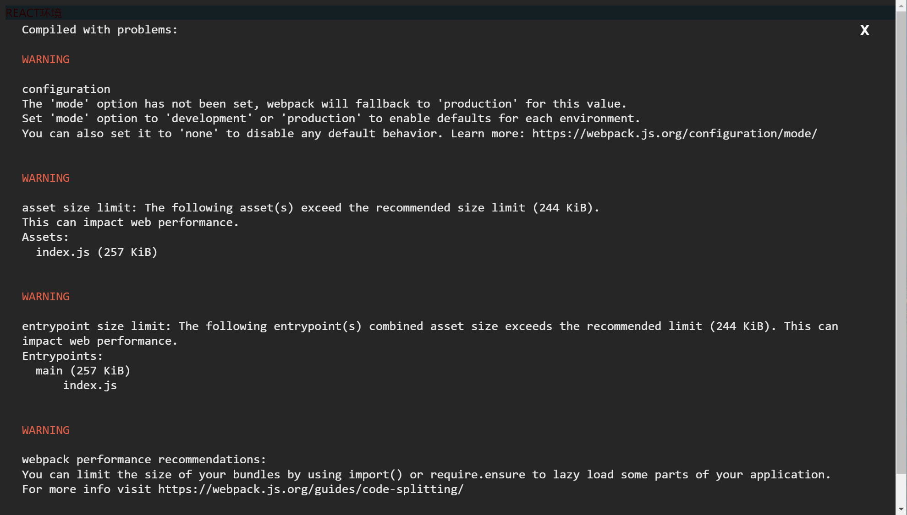
虽然报错了几条信息，但其实我们已经启动成功了。根据报错提示，错误有2点  
1、我们打包后的文件大小超过了webpack设置的大小，所以有了warining提示。  
2、没有设置mode  

因此我们添加配置，重新运行就完美了  

```javascript
mode: 'development', // 可以设置node/development/production,对打包的文件格式有影响
performance: {
  "maxEntrypointSize": 1024 * 1024, // 入口文件超过多少会提示
  "maxAssetSize": 1024 * 1024 // 1m 打包的asset资源，超过多少会提示
},
```


此时热更新就完成了。我们修改时，保存过后会自动刷新页面变动的部分。

**然而**

**模块热替换(HMR)**
对于js/ts文件来说，没有做到模块热替换。当某个js/ts文件发生变化时，会使整个页面刷新。（css/less已经支持模块热替换，因为css/less-loader已经集成了这个功能）。
这时候需要使用react官方的插件react-refresh和@pmmmwh/react-refresh-webpack-plugin
```
npm install -D react-refresh @pmmmwh/react-refresh-webpack-plugin
```

```javascript
const ReactRefreshPlugin = require('@pmmmwh/react-refresh-webpack-plugin');
plugins: [
    new ReactRefreshPlugin()
]
options: {
  "plugins": ["react-refresh/babel"], // 为 react-refresh 添加
}
```
配置好之后重新启动项目，当我们改变组件一的代码，组件二的内容不会被刷新。
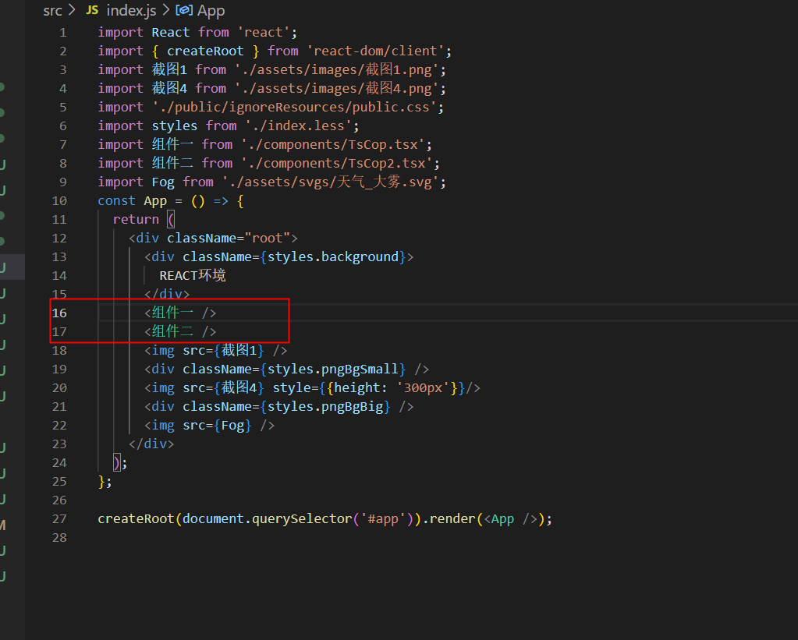
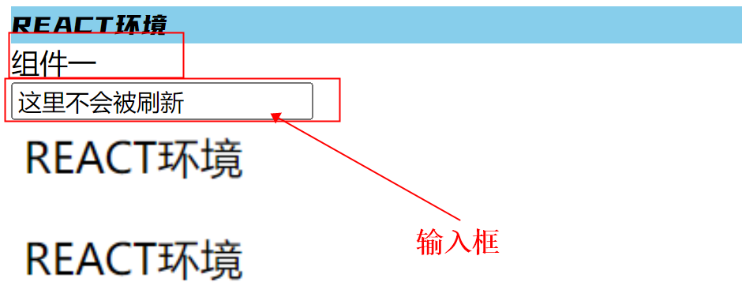

----

**<a id="代码兼容性处理">代码兼容性处理</a>**  

**browserslist**  
处理兼容性问题，首先我们要明确兼容哪些平台。而配置这些目标平台的属性就是browserslist，它有几种方法可以声明，但我主要推荐以下2种。  
在package.json声明
```javascript
{
  "browserslist": [
    "> 0.01%",
    "last 2 version",
    "not dead"
  ]
}

```  
新建.browserslistrc文件
```
> 0.01%
last 2 version
not dead
```

明确了兼容平台之后，开始处理兼容性问题  

**css**  

处理css兼容性问题，需要用到的loader是postcss-loader
```
npm install -D postcss-loader
```
但是这个psotcss-loader和babel-loader一样，只负责语法的解析，需要配合插件才能达到语法兼容效果。  

例如添加前缀的插件**autoperfixer**
```css
{
  display: flex;
}
🡇(> 0.01%)
{
  display: -webkit-box;
  display: -webkit-flex;
  display: -moz-box;
  display: -ms-flexbox;
  display: flex;
}
```
但是我们还需要其他插件，例如处理16进制颜色转换到rgba的插件等。  
和babel-loader一样，插件一个一个添加太麻烦和不便于维护，所以有了一个预设**postcss-preset-env**  

```
npm install -D postcss-preset-env
```

**postcss-preset-env**  

处理兼容性问题，需要在css-loader生效之前处理。配置为
```javascript
{
  test: /\.css$/,
  // 使用多个loader的方式
  use: [
    'style-loader',
    'css-loader',
    {
      loader: 'postcss-loader',
      options: {
        postcssOptions: {
          plugins: ['postcss-preset-env']
        }
      }
    }
  ]
}
```

添加完配置之后，重新运行发现已经生效了
```css
.root{
  display: flex;
  color: #ff0000ff;
}
```
🡇
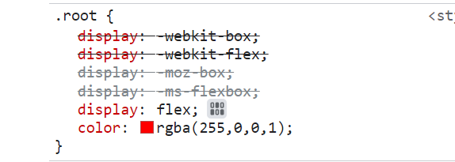

**js**  

处理js语法兼容性问题，不同的问题用到不同的插件。这里为了方便用到了babel-loader的预设@babel/preset-env，预设集成了各种语法转换插件。babel7以后，移除了@babel/preset-stage-x。@babel/preset-env默认支持所有最新的语法。如果需要支持stage阶段，需要另外单独引入plugin

```
npm install -D @babel/preset-env
```

```javascript
"presets": [
  [
    "@babel/preset-env"
  ],
  "@babel/preset-react"
]
```

此时配置已经生效了，打包后的结果变成了，成功编译了ES6...解构的语法
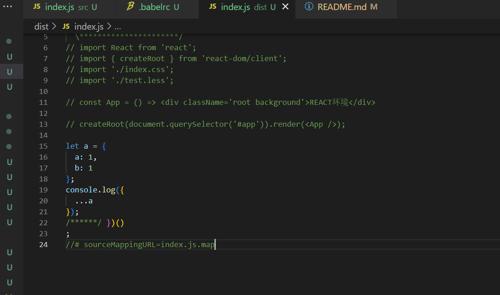
🡇
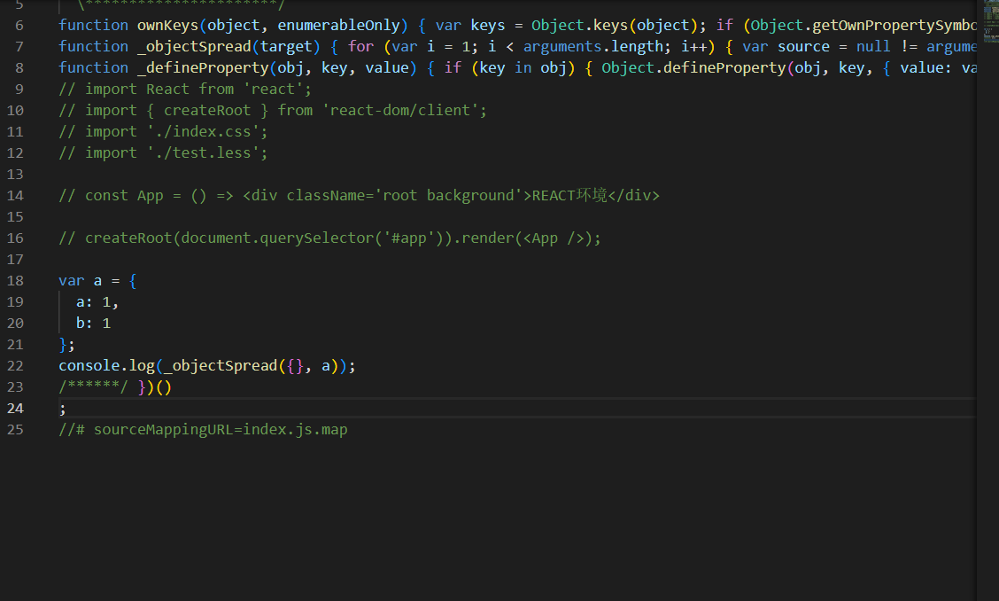

但是，@babel/preset-env只能解决我们的语法问题，例如...和.?等，并不能拓展新的对象功能，例如Promise，Array.prototype.filter等。所以，我们还需要用到@babel/polyfill。  

**@babel/polyfill**  

在以前，我们@babel7.4.0之前，我们只要下载@babel/polyfill，然后配置就生效了。
```javascript
[
  "@babel/preset-env",
  {
    "useBuiltIns": "usage",
    "corejs": "3"
  }
],
```

但是@babel7.4.0之后，官方把它拆分成core-js和regenerator-runtime，可以进行分别引入。所以现在我们要

```
npm i core-js regenerator-runtime
```
配置还是一样
```javascript
[
  "@babel/preset-env",
  {
    // false 不使用任何的polyfill
    // 以下的两个值可能会发生冲突(加入第三方库如果实现了关于polyfill相关的西，你再实现 会有冲突的问题)，解决：在babel-loader中加入exclude属性
    // usage 根据源代码需要哪些polyfil就引入相关的api
    // entry 只要是浏览器需要的polyfill都引入(不是根据源代码应用哪polyfill)
    "useBuiltIns": "usage", // false "usage" "entry"
    "corejs": "3" // useBuiltIns为usage时需要声明core-js的版本为3
  }
],
```


----

**<a id="抽离.babelrc和postcss.config.js">抽离.babelrc和postcss.config.js</a>**  

为了便于维护以及提高复用性，webpack允许将babel-loader和postcss-loader的配置独立出来。  
在根目录下新建.babelrc  
```javascript
{
  "presets": ["@babel/preset-react"]
}
```
在根目录下新建postcss.config.js  
```javascript
module.exports = {
  plugins: ['postcss-preset-env']
}
```

有了这2个配置文件之后，我们在webpack的配置那里就无需再重复写，当检测到用到对应loader之后，会使用我们独立的配置。  
贴上目前为止完整的webpack配置
```javascript
const path = require('path');
const HtmlWebpackPlugin = require('html-webpack-plugin');
const { CleanWebpackPlugin } = require('clean-webpack-plugin')
module.exports = {
  entry: './src/index.js',
  mode: 'development',
  performance: {
    "maxEntrypointSize": 1024 * 1024, // 入口文件超过多少会提示
    "maxAssetSize": 1024 * 1024 // 1m 打包的asset资源，超过多少会提示
  },
  output: {
    path: path.resolve(__dirname, 'dist'),
    filename: 'index.js',
    publicPath: '/'
  },
  devServer: {
    host: 'localhost',
    port: 5200,
    compress: true, // 服务器压缩
    open: true, // 自动打开页面
    hot: true, // 热更新
  },
  module: {
    rules: [
      {
        test: /\.js$/,
        loader: 'babel-loader',
        exclude: /node_modules/, // 不处理的文件夹
      },
      {
        test: /\.css$/,
        use: ['style-loader', 'css-loader', 'postcss-loader']
      },
      {
        test: /\.less$/,
        use: ['style-loader', 'css-loader', 'postcss-loader', 'less-loader']
      }
    ]
  },
  plugins: [
    // **/*表示会取output.path的目录，
    // !取反，表示不会被删除
    new CleanWebpackPlugin({
      cleanOnceBeforeBuildPatterns: ['**/*', '!不会被删除的文件.html']
    }),
    new HtmlWebpackPlugin({
      template: './src/public/index.html',
      publicPath: '/'
    })
  ]
}
```

----

**<a id="typescript支持">typescript支持</a>** 

首先下载ts-loader
```
npm i -D ts-loader
```

webpack.config.json配置

```javascript
{
  test: /\.(ts|tsx)$/,
  loader: 'ts-loader',
  exclude: /node_modules/, // 不处理的文件夹
},
```
在根目录新建tsconfig.json。语法转换都在这里配置，详细的配置详情查看官网
```javascript
{
  "compilerOptions": {
    "target": "ES5", // 编译后的目标javascript版本， ES5, ES6/ES2015, ES2016, ES2017, ES2018, ES2019, ES2020, ESNext
    "jsx": "react", // jsx编译成功react模式，生成React.createElement
    "esModuleInterop": true, //允许我们使用commonjs的方式import默认文件， import React from 'react'
  }
}
```

配置完这2个地方之后，就能正常书写ts和tsx文件了  

**但是**，ts不会帮我们注入polyfill，这样配置的话某些低版本浏览器当用到Promise、Array.prototype.filter等，会出现报错。虽然也可以通过balbel-loader，结合@babel/preset-typescript插件帮我们编译ts代码。但是该插件是不会帮我们进行类型校验的。  

**最完美的方案是babel-loader、ts-loader结合**，ts-loader处理完之后，交给babel-loader处理语法问题

```javascript
{
  test: /\.(ts|tsx)$/,
  exclude: /node_modules/, // 不处理的文件夹
  use: ['babel-loader', 'ts-loader'],
},
```


**<a id="typescript模块声明">typescript模块声明</a>**  
在ts里面，导入的模块都需要有声明。但如果我们有些文件是js写的，或者第三方插件用js写的。他们自身并没有声明文件。这时候就需要我们自己定义声明文件。或者下载官方的@types/**声明文件。  

**@types**  

我们看node_modules下的@types目录，这里我们已经有下载好某些声明文件，例如react和react-dom。  

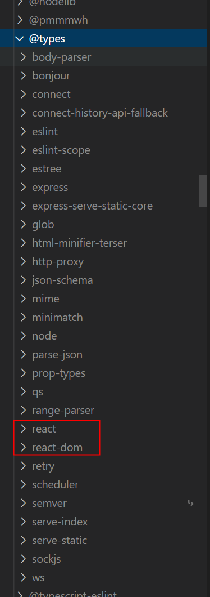

所以我们才能在ts文件里面导入react和react-dom不会有错误提示。

**自定义声明文件**  

我们在导入.less/.png/.svg等等文件时，如果我们没有找到对应的@types声明，这就需要我们手动写.d.ts声明文件（可以在项目的任何地方写，只要是.d.ts拓展名就行）。  
例如我们在根目录新建声明文件  

**types.d.ts**

```typescript
declare module '*.less' {
  const less: { readonly [key: string]: string };
  export default less;
}

declare module '*.css';
declare module '*.png';
declare module '*.jpg';

declare module '*.svg' {
  export function ReactComponent(props: React.SVGProps<SVGSVGElement>): React.ReactElement;
  const url: string;
  export default url;
}

```

如果声明不加任何导出，例如  

```typescript
declare module '*.png';
```
就表示该模块导出的是**any**类型


----

**<a id="资源模块(asset module)">资源模块(asset module)</a>**  

webpack5后，内置了模块类型，无需再下载额外loader。  
配置
```javascript
{
  test: /\.(jpg|jpeg|png|gif)$/,
  type: 'asset', // 'asset-resource'|'asset-inline'|'asset'|'asset-source' 
  generator: {
    filename: 'images/[name].[hash:10][ext]'
  },
  parser: {
    dataUrlCondition: {
      maxSize: 100 * 1024 // 80kb
    }
  }
},
```
type属性：  
- asset/resource 发送一个单独的文件并导出 URL。之前通过使用 file-loader 实现。  
- asset/inline 导出一个资源的 data URI。之前通过使用 url-loader 实现。
- asset 在导出一个 data URI 和发送一个单独的文件之间自动选择。之前通过使用 url-loader，并且配置资源体积限制实现。
- asset/source 导出资源的源代码。之前通过使用 raw-loader 实现。

- generator.filename：  
[name]表示原文件名称  
[hash:10]表示根据文件内容取hash值得前10位  
[ext]文件的拓展名  
images/：表示资源放在打包目录下的images文件夹

**在 type:"asset" 中**
```javascript
parser: {
  dataUrlCondition: {
    maxSize: 100 * 1024 // 80kb
  }
}
```
通过此配置，根据文件大小，判断是否导出一个资源的 data URI。否则默认情况下小于 8kb 的文件，将会视为 inline 模块类型，否则会被视为 resource 模块类型。  

我们还可以在output下，设置assetModuleFilename，决定默认的导出文件的路径和名称  
```javascript
output: {
  assetModuleFilename: 'resources/[name].[hash:5][ext]'
},
```
验证：  
src/index.js （其中截图4大于80kb）
```javascript
import React from 'react';
import { createRoot } from 'react-dom/client';
import 截图1 from './assets/images/截图1.png';
import 截图4 from './assets/images/截图4.png';
import './public/ignoreResources/public.css';
import styles from './index.less';
import Fog from './assets/svgs/天气_大雾.svg';

const App = () => {
  return (
    <div className="root">
      <div className={styles.background}>
        REACT环境
      </div>
      
      <div className={styles.pngBgSmall} />
      
      <div className={styles.pngBgBig} />
      
    </div>
  );
};

createRoot(document.querySelector('#app')).render(<App />);
```
./public/ignoreResources/public.css
```css
@font-face {
  font-family: YouSheBiaoTiHei;
  src: url('../../assets/fonts/YouSheBiaoTiHei.ttf');
}
```
./index.less
```css
.background{
  background-color: skyblue;
  display: flex;
  font-family: YouSheBiaoTiHei;
}
.pngBgSmall{
  background-image: url('./assets/images/截图1.png');
  background-repeat: no-repeat;
  width: 100%;
  height: 50px
}
.pngBgBig{
  background-image: url('./assets/images/截图4.png');
  background-repeat: no-repeat;
  background-size: auto 100%;
  height: 300px;
}
```
```javascript
output.assetModuleFilename: 'resources/[name].[hash:5][ext]'
{
  test: /\.(jpg|jpeg|png|gif)$/,
  type: 'asset',
  generator: {
    filename: 'images/[name].[hash:10][ext]'
  },
  parser: {
    dataUrlCondition: {
      maxSize: 100 * 1024 // 80kb
    }
  }
},
{
  test: /\.ttf$/,
  type: 'asset/resource',
  generator: {
    filename: 'fonts/[name].[hash:10][ext]'
  }
},
{
  test: /\.svg$/,
  type: 'asset/resource'
}
```
打包后的目录和浏览器运行效果：
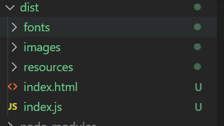
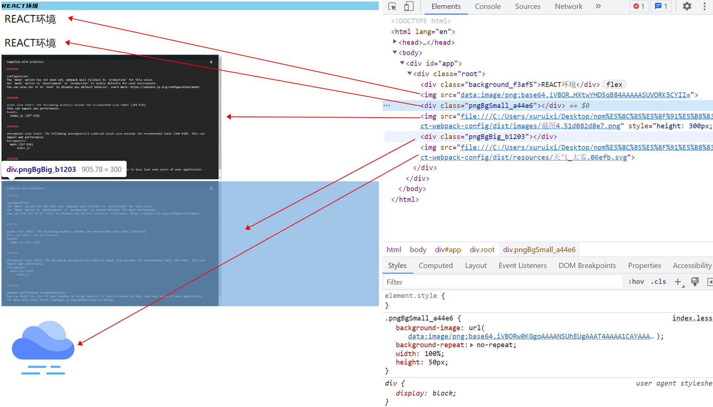

可以看出没有独立配置filename的svg，被放进了assetModuleFilename设置的目录
而且小于80kb的图片被打包成base64放进了html里面


**<a id="eslint支持">eslint支持</a>**  

需要项目支持eslint，首先我们需要下载eslint
```
npm install -D eslint
```
然后执行.bin目录下的eslinit --init指令

```
.\node_modules\.bin\eslint --init
```
或者使用npx都可以
```
npx eslint --init
```

执行这两个命令之后，按照要求回答一些问题然后会自动下载需要的依赖文件，以及在根目录生成.eslintrc.js文件。

**但是，我们打算从0来配置一遍**  

首先vscode下载eslint插件并启用。

```
npm install -D eslint @typescript-eslint/eslint-plugin @typescript-eslint/parser eslint-plugin-react eslint-plugin-html
```

在项目根目录新建eslint配置文件
.eslintrc.js

```javascript
module.exports = {
  parser:  '@typescript-eslint/parser',  // 指定ESLint解析器
  env: {
    browser: true,
    es6: true,
    node: true,
  },
  extends: [
    'plugin:react/recommended', // 使用来自 @eslint-plugin-react 的推荐规则
    'plugin:@typescript-eslint/recommended',  // 使用来自@typescript-eslint/eslint-plugin的推荐规则
  ],
  overrides: [],
  parserOptions: {},
  plugins: [
    'html', // html文件检测
  ],
  rules: {
    "no-console": 1,
    "no-alert": 1,
    semi: [2, "always"], // 语句强制分号结尾
    "@typescript-eslint/no-inferrable-types": 0, // 简单类型的变量不用声明类型 const a:bumber=12
    "@typescript-eslint/no-var-requires": 0, // 以const module = require()不报错
  },
};

```

这时eslint就生效了。

**<a id="Jest单元测试">Jest单元测试</a>**  

首先下载Jest
```
npm install -D jest
```

在根目录新建test文件夹
然后再src目录下创建sum.js
```javascript
const sum = (a, b) => a + b;
export default sum;
```  

然后再test目录下创建sum.test.js  
```javascript
// 默认只支持commonJs
const sum = require('../src/index').default;
test('1 + 2 = 3', () => {
  expect(sum(1, 2)).toBe(3);
});
```

在package.json配置测试脚本
```javascript
"scripts": {
  "test": "jest"
},
```

在.eslintrc.js配置eslint支持jest
```javascript
env: {
    jest: true, // 增加jest环境
},
```

**Jest支持typescript和ESM**

支持ESM只需要引入babel的预设@babel/preset-env就可以了，支持typescript需要我们在babel引入@babel/preset-typescript。

```
npm install -D @babel/preset-typescript @babel/preset-env @types/jest
```

ps：ts文件的jest模块声明（@types/jest）

所以.babelrc.js
```javascript
module.exports = {
  presets: [
    [
      "@babel/preset-env",
    ],
  "@babel/preset-typescript"
  ]
}
```

**提示：** 在Jest里有一个babel-jest组件，我们在使用npm run test的时候，它先去检测开发环境中是否安装了babel,如果有就会去查看.babelrc配置文件，根据配置文件进行转换。  

<mark>验证</mark>

然后再src目录下创建sum.ts
```javascript
const sum = (a:number, b:number):number => a + b;
export default sum;
```  

然后再test目录下创建sum.test.ts  
```typescript
// 默认只支持commonJs
import sum from '../src/sum';
test('1 + 2 = 3', () => {
  expect(sum(1, 2)).toBe(3);
});
```

执行

```
npm run test
```

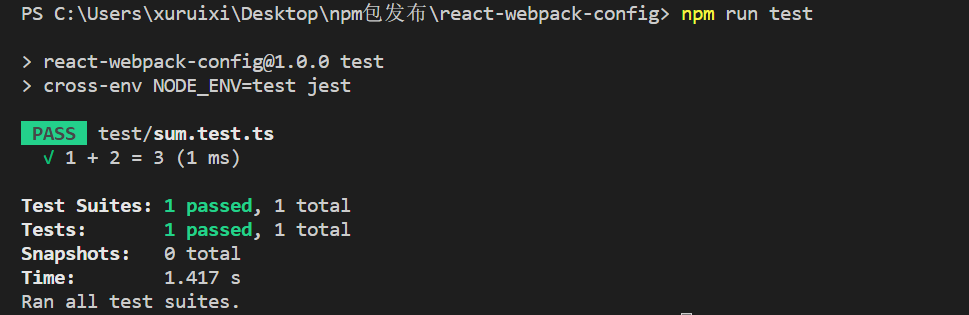  


---


**<a id="devtool（source-map）">devtool（source-map）</a>**  

配置
```javascript
module.exports = {
  devtool: 'source-map', // 其他参数功能请参考官方文档
}
```
该模式下，报错的时候，在浏览器就能够定位到具体代码行数和列（生成map文件，打包代码和原代码一一对应）
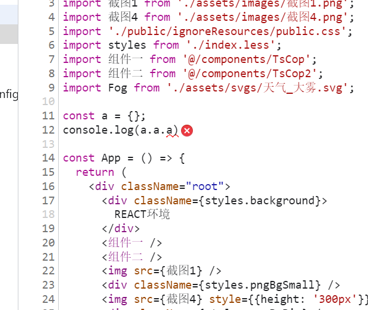  

---

**<a id="路径自动补全(resolve)">路径自动补全(resolve)</a>**  


配置
```javascript
module.exports = {
  // 自动补全省略的后缀
  resolve: {
    extensions: ['.js', '.jsx', '.json', '.ts', '.tsx'],
    alias: {
      '@': path.resolve(__dirname, './src'),
    },
    // 告诉webpack解析模块时应该搜索的目录
    modules: ['node_modules', resolve('src')],
    // 告诉webpack解析loader时应该搜索的目录
    resolveLoader: {
      modules: ['node_modules',resolve('loader')]
    },
  },
}
```
extensions表示省略文件后缀时，自动帮我们补全的后缀。  
alias表示路径补全  
__dirname表示webpack配置文件的执行目录  
然后我们就可以这样使用了
```javascript
import 组件一 from '@/components/TsCop';
```

---

**<a id="本地开发服务的history模式">本地开发服务的history模式</a>**  

我们在使用react-router开发，路由模式有history/hash模式。当时我们开启本地服务器开发时，如果使用了history模式，如果不进行相应的设置，进入某个路由之后，刷新页面会出现404的情况。那是因为浏览器根据url进行了资源请求，但是资源为空导致404。  

webpack根据这种情况也给出了解决方案，

```javascript
module.exports = {
devServer: {
    host: 'localhost',
    port: 5200,
    compress: true, // 服务器压缩
    open: false, // 自动打开页面
    hot: true, // 热更新(默认开启)
    historyApiFallback: {
      index: '/index.html'
    },
  },
}
```

核心就是这段配置，如果匹配不到资源的时候，总是返回/index.html
```javascript
historyApiFallback: {
  index: '/index.html'
},
```


---

**<a id="配置环境变量">配置环境变量</a>**  

我们可以在正在执行命令的时候，可以给NODE环境设置一个变量，通过process.env.xxxxx来获取。但是不同的平台，指令有些不同。为了解决这一问题，我们通过cross-env设置环境变量，可以很好的是适配多个平台。

```
npm install -D cross-env
```

package.json（这里设置了process.env.NODE_ENV === 'development'，然后我们就能在编译阶段拿到该变量）
```json
"start": "cross-env NODE_ENV=development webpack-dev-server --config xrx.webpack.config.js",
```

---

**<a id="配置文件拆分">配置文件拆分</a>**  

到目前为止，我们本地开发和打包上线，用的都是同一份配置文件。但这是不合理的，例如  **@pmmmwh/react-refresh-webpack-plugin**  只有在本地开发时才用到，打包的时候不需要。  

所以，我们把webpack.config.js拆分成3份  
**base.config.js：** 通用的配置  
**dev.config.js：** 开发环境的配置  
**prod.config.js：** 打包生产的配置  

然后再通过webpack-merge插件提供的merge方法，将配置组合。


设置环境变量，我们统一配置文件入口为./config/webpack.config.js  

package.json设置脚本
```json
  "scripts": {
    "build": "cross-env NODE_ENV=production webpack --config config/webpack.config.js",
    "start": "cross-env NODE_ENV=development webpack-dev-server --config config/webpack.config.js",
    "test": "cross-env NODE_ENV=test jest"
  },
```

./config/base.config.js  
```javascript
const path = require('path');
const HtmlWebpackPlugin = require('html-webpack-plugin');
const CopyWebpackPlugin = require('copy-webpack-plugin');

module.exports = {
  entry: './src/index.tsx',
  performance: {
    "maxAssetSize": 1024 * 1024 // 1m 打包的asset资源，超过多少会提示
  },
  // 自动补全省略的后缀
  resolve: {
    extensions: ['.js', '.jsx', '.json', '.ts', '.tsx'],
    alias: {
      '@': path.resolve(__dirname, '../src'),
    },
    // 告诉webpack解析模块时应该搜索的目录
    modules: ['node_modules', resolve('src')],
    // 告诉webpack解析loader时应该搜索的目录
    resolveLoader: {
      modules: ['node_modules', resolve('loader')]
    },
  },
  module: {
    rules: [
      {
        test: /\.js$/,
        loader: 'babel-loader',
        exclude: /node_modules/, // 不处理的文件夹
      },
      {
        test: /\.(ts|tsx)$/,
        exclude: /node_modules/, // 不处理的文件夹
        use: ['babel-loader', 'ts-loader'],
      },
      {
        test: /\.css$/,
        // 使用多个loader的方式
        use: [
          'style-loader',
          {
            loader: 'css-loader',
            options: {
              importLoaders: 1,
            }
          },
          'postcss-loader'
        ]
      },
      {
        test: /\.less$/,
        // 使用多个loader的方式  
        use: [
          'style-loader',
          {
            loader: 'css-loader',
            options: {
              modules: {
                localIdentName: '[local]_[hash:5]'
              },
              importLoaders: 1,
            }
          },
          'postcss-loader',
          'less-loader'
        ]
      },
      // webpack5开始，静态资源统一由asset模块处理
      {
        test: /\.(jpg|jpeg|png|gif)$/,
        type: 'asset',
        generator: {
          filename: 'images/[name].[hash:10][ext]'
        },
        parser: {
          dataUrlCondition: {
            maxSize: 100 * 1024 // 80kb
          }
        }
      },
      {
        test: /\.ttf$/,
        type: 'asset/resource',
        generator: {
          filename: 'fonts/[name].[hash:10][ext]'
        }
      },
      {
        test: /\.svg$/,
        type: 'asset/resource'
      }
    ]
  },
  plugins: [
    new HtmlWebpackPlugin({
      template: './src/public/ignoreResources/index.html',
      publicPath: '/'
    }),
    // ignore表示不会被复制的目录
    new CopyWebpackPlugin({
      patterns: [
        {
          from: './src/public',
          to: 'public',
          noErrorOnMissing: true, // 当noErrorOnMissing设置为true时，如果源文件不存在，CopyWebpackPlugin不会抛出错误，而是跳过该文件的复制。
          globOptions: {
            ignore: ["**/ignoreResources/**"],
          },
        },
        {
          from: './src/public/ignoreResources/favicon.ico',
          to: '.',
        }
      ]
    })
  ]
};
```

./config/dev.config.js  
```javascript
const ReactRefreshPlugin = require('@pmmmwh/react-refresh-webpack-plugin');
module.exports = {
  mode: 'development',
  devtool: 'source-map',
  devServer: {
    host: 'localhost',
    port: 5200,
    compress: true, // 服务器压缩
    open: false, // 自动打开页面
    hot: true, // 热更新(默认开启)
    historyApiFallback: {
      index: '/index.html'
    },
  },
  plugins: [
    new ReactRefreshPlugin(),
  ]
};
```

./config/prod.config.js  
```javascript
const path = require('path');
const { CleanWebpackPlugin } = require('clean-webpack-plugin');

module.exports = {
  mode: 'production',
  devtool: 'eval',
  output: {
    path: path.resolve(__dirname, '../dist'),
    filename: 'index.js',
    // publicPath: '',
    assetModuleFilename: 'resources/[name].[hash:5][ext]'
  },
  plugins: [
    // **/*表示会取output.path的目录
    // !取反，表示不会被删除
    new CleanWebpackPlugin({
      cleanOnceBeforeBuildPatterns: ['**/*', '!不会被删除的文件.html']
    }),
  ]
};
```

./config/webpack.config.js  
```javascript
const { merge } = require('webpack-merge');
const baseConfig = require('./base.config');
const env = process.env.NODE_ENV;
let config = '';
if (env === 'production') {
  config = require('./prod.config');
} else if (env === 'development') {
  config = require('./dev.config');
}
module.exports = merge(baseConfig, config);
```

在.babelrc.js
```javascript
const env = process.env.NODE_ENV;
let plugins = [];
let presets = [
  [
    "@babel/preset-env",
    {
      // false 不使用任何的polyfill
      // 以下的两个值可能会发生冲突(加入第三方库如果实现了关于polyfill相关的西，你再实现 会有冲突的问题)，解决：在babel-loader中加入exclude属性
      // usage 根据源代码需要哪些polyfil就引入相关的api
      // entry 只要是浏览器需要的polyfill都引入(不是根据源代码应用哪polyfill)
      "useBuiltIns": "usage", // false "usage" "entry"
      "corejs": "3", // useBuiltIns为usage时需要声明core-js的版本为3
    }
  ],
  "@babel/preset-react",
]
if (env === 'development') plugins = [...plugins, "react-refresh/babel"];
if (env === 'test') presets = [...presets, "@babel/preset-typescript"];
module.exports = {
  presets,
  plugins,
}
```

这样我们就能够根据环境变量加载不同的配置了。

---

**<a id="husky代码提交校验">husky代码提交校验</a>**  

通过husky可以配置githooks的操作，但是husky在6.0.0之后有了破坏性的改变。

同时，我们还需要lint-staged，这个插件可以让我们只检测暂存区的文件。（如果我们不嫌弃每次全量eslint检测全量的文件，也可以不用这个）  
```
npm install -D husky lint-staged
```

在继续执行命令之前，先看一下旧版本(< 6.0.0)的配置方式，方便解释接下来的操作。  
**在6.0.0之前**
package.json
```json
"scripts": {
  "lint-staged": "lint-staged",
},
"lint-staged": {
    "*.{js,jsx,ts,tsx}": [
      "eslint"
    ]
  },
  "husky": {
    "hooks": {
      "pre-commit": "lint-staged"
    }
  },
```
我摘录下官方说法的网上翻译
```
husky为什么放弃了之前的配置方式
根据官方的说法，之前husky的工作方式是这样的，为了能够让用户设置任何类型的git hooks都能正常工作，husky不得不创建所有类型的git hooks。这样在git 工作的每个阶段都会调用husky所设置的脚本，在这个脚本中husky会检查用户是否配置该hook，如果有就运行用户配置的命令，如果没有就继续往下执行。

这样做的好处就是无论用户设置什么类型的git hook husky都能确保其正常运行。但是缺点也是显而易见的，即使用户没有设置任何git hook，husky也向git中添加了所有类型的git hook。

那有没有可能让husky只添加我们需要的git hook呢？作者尝试过解决这个问题，但是失败了。究其失败的根本原因，就是因为husky需要在两个地方进行配置才能完成一个完整的git hook功能。一个是在package.json中配置git hook所要执行的真正命令，一个是在.git/hooks/中配置相对应的git hook。也就是说无论是添加还是删除git hook就要保证在这两个地方同步执行对应的操作。作者无法找到一个可靠的方法来同步这两个地方的配置，因此失败了。

作者认为这个问题是由husky工作模型的自身缺陷导致的，如果想要解决就不得不另辟蹊径采用一种新的工作模型。因此新版husky做了破坏性的变更。

新版husky的工作原理
新版的husky使用了从git 2.9开始引入的一个新功能core.hooksPath。core.hooksPath可以让你指定git hooks所在的目录而不是使用默认的.git/hooks/。这样husky可以使用husky install将git hooks的目录指定为.husky/，然后使用husky add命令向.husky/中添加hook。通过这种方式我们就可以只添加我们需要的git hook，而且所有的脚本都保存在了一个地方（.husky/目录下）因此也就不存在同步文件的问题了。
```

所以现在的操作：
首先配置prepare脚本
```json
{
  "scripts": {
    "prepare": "husky install"
  }
}

```

prepare是npm的一个生命周期，它会在执行完npm install之后执行。  

执行 husky install命令，该命令会创建.husky/目录并指定该目录为git hooks所在的目录。

**然后**  
添加git hooks，运行一下命令创建git hooks

```
npx husky add .husky/pre-commit "npm run lint-staged"
```

运行完该命令后我们会看到.husky/目录下新增了一个名为pre-commit的shell脚本。也就是说在在执行git commit命令时会先执行pre-commit这个脚本。pre-commit脚本内容如下：

```shell
#!/usr/bin/env sh
. "$(dirname -- "$0")/_/husky.sh"
npm run lint-staged
```

可以看到该脚本的功能就是执行npm run lint-staged这个命令

package.json
```json
"scripts": {
  "lint-staged": "lint-staged",
  "prepare": "husky install"
},
"lint-staged": {
  "*.{js,jsx,ts,tsx}": [
    "eslint"
  ]
},
```

配置完成后，当我们commit代码的时候，会基于eslint配置的规则，校验我们暂存区的代码，只有校验通过之后能提交。


---

**<a id="性能优化相关专题">性能优化相关专题</a>**  

---


**<a id="优化打包速度">优化打包速度</a>**


- **<a id="构建费时分析">构建费时分析</a>**  

使用**speed-measure-webpack-plugin**插件，可以分析每个loader和plugin的耗时，从而找到构建费时的原因。

webpack.config.js
```js
const SpeedMeasurePlugin = require('speed-measure-webpack-plugin');
const smp = new SpeedMeasurePlugin();
module.exports = smp.wrap({
  // ...
});
```

- **<a id="缩小loader使用范围">缩小loader使用范围</a>**

配置loader的include 和 exclude 两个配置项

```
include：符合条件的模块进行解析（如果设置了这个，那么就只解析这个）
exclude：排除符合条件的模块，不解析（优先级最高）
```

- **<a id="设置不解析的模块noParse">设置不解析的模块noParse</a>**  

设置了该字段后，webpack将不会解析该模块了，从而提高构建速度。但是需要注意的是，如果该模块中没有其他依赖，那么可以设置该字段，否则会导致该模块中的依赖无法解析，从而导致构建失败。

```js
const config = {
  //...
  module: { 
    noParse: /jquery|lodash/,
    rules:[...]
  }
};
```

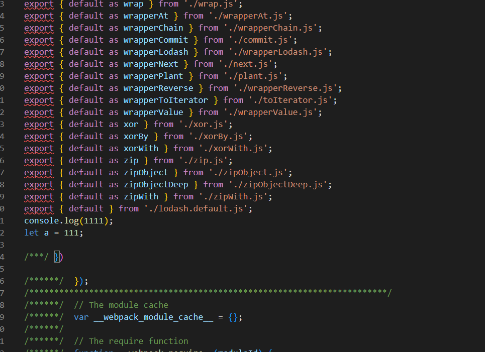


- **<a id="开启文件缓存，提升二次构建速度">开启文件缓存，提升二次构建速度</a>**  

首次构建，webpack会把构建好的缓存文件写到node_modules/.cache/webpack目录下，二次构建的时候，会从这个目录下读取缓存文件，如果缓存文件没有变化，就不会重新构建，从而提升构建速度。

```js
module.exports = {
  // ...
  cache: {
    type: 'filesystem',
  },
};
```


- **<a id="多进程配置">多进程配置</a>**  

loader：**thread-loader**  
开启子进程，会有额外的性能开销，webpack官网提示大概消耗600ms，所以只有当loader处理时间比较长的时候，才会考虑使用该loader。

```js
const config = {
  module: { 
    rules: [
      {
        test: /\.js$/i,
        use: [
          {
            loader: 'thread-loader', // 开启多进程打包
            options: {
              worker: 3,
            }
          },
          'babel-loader',
        ]
      },
    ]
  }
};
```

**<a id="优化打包结果">优化打包结果</a>**

- **<a id="打包结果分析">打包结果分析</a>**  

```js
const BundleAnalyzerPlugin = require('webpack-bundle-analyzer').BundleAnalyzerPlugin;

plugins: [
    new BundleAnalyzerPlugin({
      // analyzerMode: 'disabled',  // 不启动展示打包报告的http服务器
      // generateStatsFile: true, // 是否生成stats.json文件
    }),
]
```
这时候我们直接运行npm run build，就会自动打开一个http服务器，展示打包结果分析报告。(这里的--progress参数是为了展示打包进度)
```json
"build": "cross-env NODE_ENV=production webpack --progress --config config/webpack.config.js",
```


- **<a id="代码压缩">代码压缩</a>**  

压缩 CSS和JS
```js
// 如果使用了样式分离，那么使用这个插件压缩css还是有帮助的
const OptimizeCssAssetsPlugin = require('optimize-css-assets-webpack-plugin');
/* 
  生产环境会默认将js代码压缩，但是当我们手动配置optimization.minimize为false的时候，就需要手动配置js代码压缩了
*/
const TerserPlugin = require('terser-webpack-plugin');

const config = {
  // ...
  optimization: {
    minimize: true, // 表示开启代码压缩
    minimizer: [
      // 添加 css 压缩配置
      new OptimizeCssAssetsPlugin({}),
      // 添加 js 压缩配置
      new TerserPlugin({})
    ]
  },
 // ...
}
```

- **<a href="tree-shaking">tree-shaking</a>**

其原理在于ES6模块系统中的静态结构。在ES6模块系统中，一旦导出一个标识符，它就变成了一个已知实体。
webpack5中默认开启。需要注意的是，ts/tsx文件中，tsconfig.json配置的target（输出）必须es2015以上。


- **<a id="打包代码剔除externals">打包代码剔除externals</a>**  

一般在写library的时候很好用。下面的代码会在打包的时候，把jquery从打包文件中剔除，使用外部的jquery。
```js
const config = {
  //...
  externals: {
    jquery: 'jQuery',
  },
};
```


**<a href="#优化运行时体验">优化运行时体验</a>**

- **<a id="模块的动态导入和预加载">模块的动态导入和预加载</a>**  

例如我们有个工具模块  
./utils.ts

```ts
const count = (num1:number, num2:number) => num1 + num2;
export default count;
```

我们希望在使用到的时候，才对其进行导入，而不是一开始就导入，这样可以减少首屏加载的时间。  
/* webpackPrefetch: true */表示在浏览器空闲的时候，提前加载该模块。  
本质是通过link标签，设置rel="prefetch"，浏览器会在空闲的时候，提前加载该模块。然后用到该模块的时候，会从缓存中读取，从而提升体验。

```ts
const count = async () => {
  const { default: count } = await import(/* webpackPrefetch: true */'./utils');
  return count(1, 2);
};
```

- **<a id="分包配置splitChunks">分包配置splitChunks</a>**
待续。

---

**<a id="package.json相关说明">package.json相关说明</a>**  

---

- **dependencies、devDependencies、peerdependency区别**  

  - **dependencies、devDependencies**：在本地开发时，没有本质的区别。只有在发布npm包时，如果对方使用npm包，在devDependencies里面的模块不会被对方下载。  
  - **peerdependency**：告诉使用者，这个包依赖于某个模块，但是不会自动安装，需要使用者自己安装。例如在antd中，它依赖于react。因此为了让开发者不重复安装react，antd把react的依赖写在了devDependencies中，然后在peerDependencies中写上react，这样使用者在安装antd的时候，会提示安装react，但是不会自动安装react。


- **版本符号**  

  ~：  指定主版本号或者次版本号相同

  |  版本范围 | 匹配版本  |
  | ------------ | ------------ |
  | ~3  | 3.x 或者 3.0.0 <= v < 4.0.0 |
  | ~3.1  |  3.1.x 或者 3.1.0 <= v <3.2.0 |
  |  ~3.1.2 | 3.1.2 < v < 3.2.0  |

  ^：  第一个非零 版本号相同

  |  版本范围 | 匹配版本  | 补充  |
  | ------------ | ------------ | ------------ |
  | ^3.1.5  | 3.1.5 <= v < 4.0.0 |  |
  | ^0.3.6  | 0.3.6 <= v < 0.4.0 |  |
  | ^0.0.2  | 0.0.2 <= v < 0.0.3 |  |
  | ^3.x.x  | 3.0.0 <= v < 4.0.0 | 版本号缺少的位置，会被 0 填充 |
  | ^4.2.x  | 4.2.0 <= v < 4.3.0 |  |

- **package.lock.json**  

  因为依赖的版本的原因，不同的时间下执行npm install 可能会下载到不同版本的  依赖。package.lock.json解决了这个问题，把依赖和依赖的依赖版本固定下来。 这样项目的各个开发者在执行npm install的时候，如果package.json的依赖包没有增加（手动删除里面的包或者版本号，不会触发package-lock.json更新，下载的时候还是以lock为准），就会按照package-lock.json去下载。要更lock的新版本号或者删除依赖，需要执行npm i xx@xx或者npm uninstall xx

---


**<a id="幽灵依赖">pnpm以及幽灵依赖</a>**  
npm会把依赖和依赖的依赖，平铺安装在node_mudules下共享使用，如果遇到依赖版本有冲突，会把后加入的依赖放到依赖的node_modules下，以此类推。  
npm上述把依赖包拍扁的做法，虽然解决了依赖嵌套的问题，但也带来了另外一个问题：依赖被平铺node_modules，导致项目没有在package.json引入的包，也能被导入（幽灵依赖，其他依赖导入了，平铺，yarn也存在同样的问题）。  
**pnpm**解决方案：首先pnpm把所有项目的依赖包存在自己的.pnpm store，在项目的node_modules只存放本项目依赖的软连接，连接到.pnpm目录下的依赖，而.pnpm里面的依赖通过硬链接直接指向.pnpm store里面真实的文件。

**优点**  
1. 因为公用store里面的包，所以即使多个项目也不会产生多余的包。节省空间。
2. 采用的软硬链接的方式，当有全局包缓存的时候，安装特别的快。
3. 解决幽灵依赖的问题。

**不足**
1. 兼容性问题，由于symbolic link（软连接）在一些场景下有兼容性问题，目前 Eletron 以及 labmda 部署的应用上无法使用 pnpm。
2. 由于共享全局的store，当某个项目修改了node_modules的源文件，那么其他公用了该文件的项目也会受到影响。

---

**<a id=".npmrc">.npmrc</a>**  

在项目的根目录下新建 .npmrc 文件

```
registry=https://registry.npm.taobao.org/
@test:registry = https://npm.xx.com
```

以@test 开头的包从 registry=https://npm.xx.com 这里下载，其余全去淘宝镜像下载。